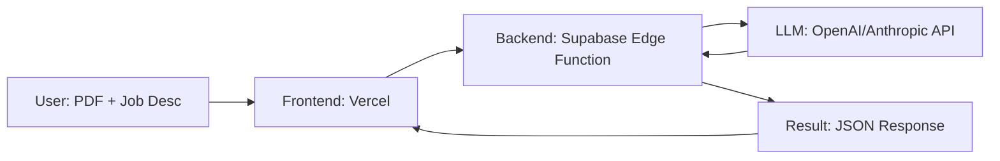
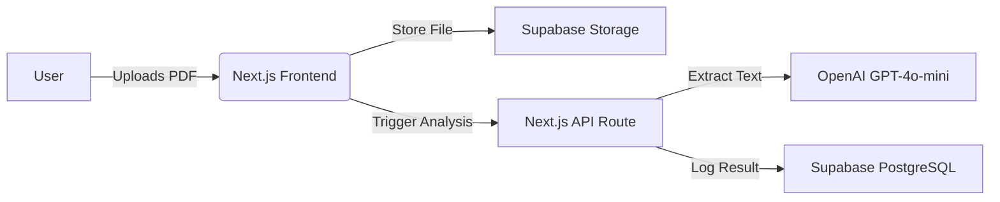
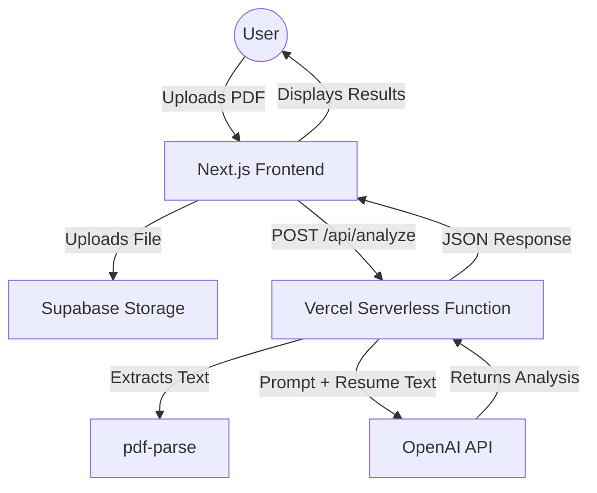
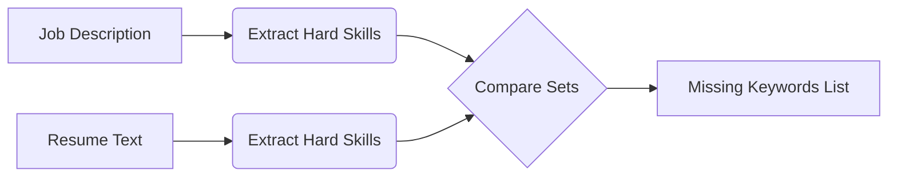
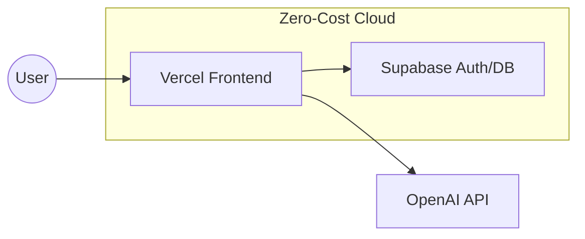
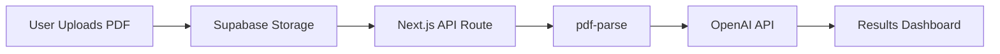

# AI Resume Matcher & Optimizer

## Project Overview & Realistic Scope

The goal of this MVP is to build a functional "Resume-to-Job" feedback loop. We are focusing on **text-based analysis** to avoid the technical overhead of parsing complex document layouts or preserving formatting. By treating the resume as raw text, we can focus entirely on the quality of the AI prompt engineering and the user experience.

### The MVP Workflow
The system will follow a linear path: User Upload → Text Extraction → AI Analysis → Structured Feedback.



### Technical Constraints
To keep this project zero-cost and manageable, we will adhere to the following:
*   **Frontend:** Next.js hosted on **Vercel**.
*   **Backend:** **Supabase Edge Functions** (TypeScript) to handle API calls securely without needing a dedicated server.
*   **PDF Parsing:** Use `pdf-parse` (Node.js) to extract raw text strings.
*   **AI Integration:** Send the extracted text and job description to an LLM via a structured prompt.

### Data Structure
To ensure the frontend can easily render the results, we will enforce a strict JSON schema for the AI response:

```json
{
  "match_score": 75,
  "missing_keywords": ["TypeScript", "CI/CD", "PostgreSQL"],
  "improvement_suggestions": [
    "Quantify your impact in the second bullet point.",
    "Highlight your experience with cloud deployment."
  ]
}
```

### Why this scope works
By limiting the scope to text analysis, you avoid the "rabbit hole" of document rendering. If a user uploads a complex PDF, the text extraction will still capture the content, and the LLM will provide high-value feedback regardless of the font or layout. This allows you to spend your time perfecting the **prompt engineering**—which is the real "magic" of this project—rather than fighting with CSS or PDF rendering libraries.

## Core Architecture & Tech Stack

To build this project with maximum velocity and zero infrastructure overhead, we will leverage a "Serverless-First" approach. By keeping the frontend and backend within the same Next.js ecosystem, we minimize context switching and simplify deployment.

### The Architecture Flow
The system is designed to be event-driven: the user uploads a PDF, the file is stored in Supabase, and the metadata is processed by the OpenAI API via a serverless function.



### Recommended Tech Stack
*   **Frontend:** Next.js (App Router) + Tailwind CSS. Use `shadcn/ui` for rapid, accessible component building.
*   **Backend:** Next.js API Routes. These act as your serverless functions, keeping your code and API logic in one repository.
*   **Database & Storage:** [Supabase](https://supabase.com/). Use **Storage** for the raw PDF files and **PostgreSQL** to store the analysis results and user session logs.
*   **Deployment:** [Vercel](https://vercel.com/). It provides seamless integration with Next.js and handles your environment variables and CI/CD via GitHub Actions automatically.

### Data Structure (PostgreSQL)
To track your resume analysis, define a simple table schema in your Supabase SQL editor:

```sql
create table resume_analysis (
  id uuid default gen_random_uuid() primary key,
  user_id uuid references auth.users,
  file_url text,
  match_score int,
  feedback jsonb,
  created_at timestamp with time zone default timezone('utc'::text, now())
);
```

### API Route Pattern
Your backend logic should be modular. Create a route at `app/api/analyze/route.ts` to handle the orchestration:

```typescript
// Example structure for your API route
export async function POST(req: Request) {
  const { fileUrl, jobDescription } = await req.json();
  
  // 1. Fetch text from PDF (using a library like pdf-parse)
  // 2. Send to OpenAI GPT-4o-mini
  const response = await openai.chat.completions.create({
    model: "gpt-4o-mini",
    messages: [{ role: "user", content: `Analyze this resume against: ${jobDescription}` }]
  });

  // 3. Save result to Supabase
  return Response.json({ success: true, data: response.choices[0].message });
}
```

**Pro-tip:** Since you are using Vercel and Supabase, keep your API keys secure by using `.env.local` for development and the Vercel Dashboard for production secrets. Never commit these to GitHub!

## System Data Flow

To keep your infrastructure lean and cost-effective, we’ll use a serverless architecture. By leveraging Supabase for file storage and Vercel for your API routes, you avoid the overhead of managing a dedicated server. The flow is designed to be asynchronous where possible, ensuring the user gets feedback quickly without blocking the main thread.

### The Request-Response Lifecycle

The following diagram illustrates how the data moves from the user's browser, through our processing pipeline, and back to the UI.



### Data Structure
When the backend processes the request, it will return a structured JSON object. Keeping this schema consistent will make it much easier to build your UI components:

```json
{
  "matchScore": 85,
  "suggestions": [
    "Add more keywords related to React hooks.",
    "Quantify your impact in the second project bullet point."
  ],
  "missingSkills": ["TypeScript", "PostgreSQL"]
}
```

### Pro-Tip for Development
Since you are using Vercel for deployment, ensure your `api/analyze.js` route handles the file reference from Supabase. You don't need to pass the entire file content through the browser; simply pass the `file_url` from Supabase to your backend, and have the backend fetch the file directly from your bucket. This keeps your frontend snappy and reduces bandwidth costs.

## Standout Upgrades

To move this project from a simple script to a professional-grade tool, we will implement three high-impact features. These additions demonstrate your ability to handle data persistence, integrate NLP, and manage file generation—all critical skills for a full-stack developer.

### 1. Resume Versioning & Analytics
Instead of a one-off analysis, store resume iterations in Supabase. By tracking the `match_score` over time, you can visualize progress using a simple line chart on the dashboard.

**Data Structure (Supabase Table: `resume_versions`):**
```json
{
  "id": "uuid",
  "user_id": "uuid",
  "job_description_id": "uuid",
  "raw_text": "string",
  "match_score": 85,
  "created_at": "timestamp"
}
```

### 2. Intelligent Keyword Gap Analysis
Use a lightweight NLP library (like `natural` for Node.js or `spaCy` for Python) to perform a set-difference operation between the job description and the resume. This provides actionable feedback rather than just a score.

**Logic Flow:**


### 3. PDF Export Engine
To make the tool truly useful, allow users to export their optimized content. Use `react-pdf` or `Puppeteer` (server-side) to inject the optimized text into a clean, ATS-friendly template.

**Deployment Tip:** Since you are using Vercel or Render, keep your PDF generation logic in a Serverless Function. This keeps your frontend lightweight and avoids heavy dependencies in the browser bundle.

**Example Vercel `vercel.json` config for server-side rendering:**
```yaml
{
  "functions": {
    "api/generate-pdf.js": {
      "memory": 1024,
      "maxDuration": 10
    }
  }
}
```

**Pro-tip for interviews:** When asked about these features, emphasize *why* you chose them. For example: "I implemented versioning because I wanted to help users treat their job search as an iterative process, much like how we version control our code." This shows you think about the user experience, not just the code.

## Deployment & Hosting Strategy

To get your AI Resume Matcher live without breaking the bank, we will leverage a "serverless-first" architecture. This approach minimizes maintenance overhead and keeps your infrastructure costs at zero while you scale.

### Architecture Overview
The following diagram illustrates how your traffic flows from the user to your Vercel-hosted frontend, which communicates securely with Supabase.



### Deployment Workflow
1.  **Frontend (Vercel):** Connect your GitHub repository to Vercel. Every time you push to `main`, Vercel will automatically build and deploy your application. This gives you instant preview URLs for every pull request.
2.  **Database & Auth (Supabase):** Use Supabase as your backend-as-a-service. You won't need to manage a server; simply define your schema in the Supabase dashboard.
3.  **Security:** Never hardcode your OpenAI API keys. Add them to your **Vercel Project Settings > Environment Variables**. 

### Configuration Snippets

**Supabase Row Level Security (RLS):**
To ensure users only see their own resumes, run this SQL in your Supabase dashboard:
```sql
-- Enable RLS
ALTER TABLE resumes ENABLE ROW LEVEL SECURITY;

-- Allow users to only read their own data
CREATE POLICY "Users can view their own resumes" ON resumes
FOR SELECT USING (auth.uid() = user_id);
```

**Vercel Environment Variables:**
Ensure your `next.config.js` or API routes access keys via `process.env`. Your `.env.local` file should look like this:
```json
{
  "NEXT_PUBLIC_SUPABASE_URL": "https://your-project-id.supabase.co",
  "NEXT_PUBLIC_SUPABASE_ANON_KEY": "your-anon-key",
  "OPENAI_API_KEY": "sk-..."
}
```

**Pro-tip:** Keep your `OPENAI_API_KEY` strictly on the server-side (in API routes). Never prefix it with `NEXT_PUBLIC_`, or it will be exposed to the browser, allowing anyone to steal your credits.

## Development Milestones

To keep your momentum high and avoid getting overwhelmed, we’ll break this project into four manageable sprints. Each phase is designed to be deployable, meaning you’ll have a working version of the app at every step.

### Phase 1: Foundation & Storage
Set up your Next.js project and connect it to Supabase. Your goal here is to get a file from the user's computer into your cloud storage bucket.
*   **Tech Stack:** Next.js (App Router), Tailwind CSS, Supabase Storage.
*   **Task:** Create a simple drag-and-drop component that uploads a PDF to a Supabase bucket.

### Phase 2: The Intelligence Layer
This is where the magic happens. You’ll extract the raw text from the PDF and send it to OpenAI.
*   **Tech Stack:** `pdf-parse` (for extraction), OpenAI Node.js SDK.
*   **Logic:** Create an API route (`/api/analyze`) that accepts the file URL, parses the text, and sends a prompt to GPT-4o-mini.

```json
// Expected API Response Structure
{
  "score": 85,
  "suggestions": [
    "Add more metrics to your experience section.",
    "Use stronger action verbs in your bullet points."
  ],
  "missing_keywords": ["TypeScript", "CI/CD"]
}
```

### Phase 3: The Results Dashboard
Build the UI to visualize the data returned from your API. Focus on readability and clear, actionable feedback.
*   **Task:** Map the JSON response to a clean dashboard layout using Recharts or simple progress bars.

### Phase 4: Polish & Deployment
Refine the user experience. Add loading skeletons while the AI is "thinking" and ensure the app looks great on mobile devices.
*   **Deployment:** Connect your GitHub repo to **Vercel** for instant, zero-cost hosting.

### Project Architecture Flow



**Pro-tip:** Use **GitHub Actions** to run a simple linting check on every push. It’s a great habit to build early, and it ensures your code stays clean as you add more features.
