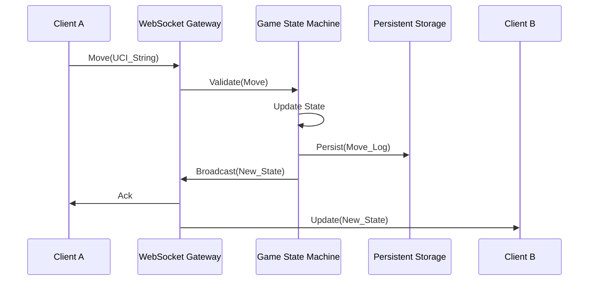
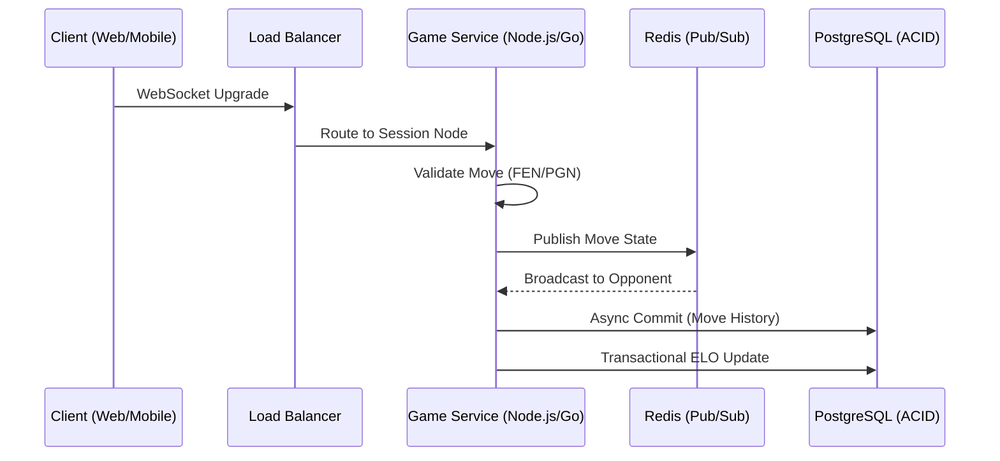
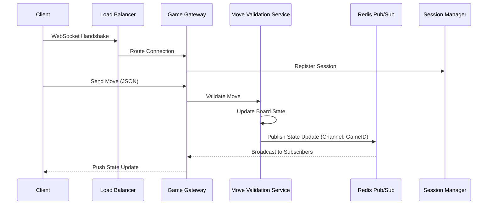
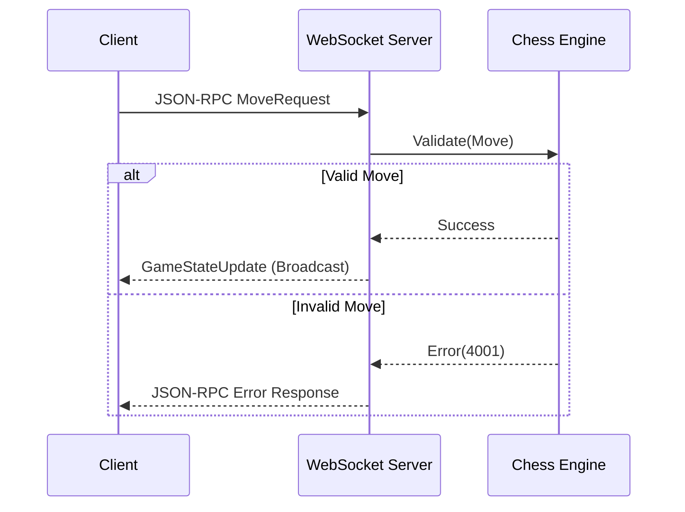
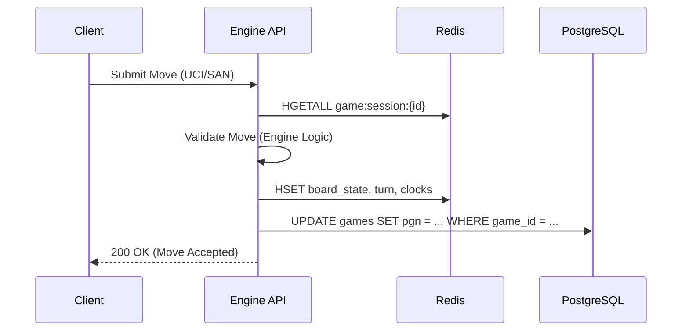
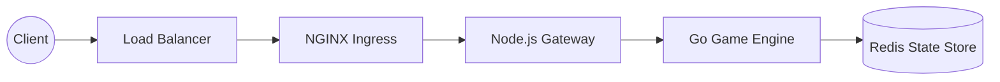

# Real-Time Distributed Chess Engine Platform

## 1. System Overview & Context

The Real-Time Distributed Chess Engine Platform is a high-concurrency, low-latency architecture designed to facilitate synchronous competitive chess matches. The system utilizes a centralized state machine to enforce FIDE-compliant move validation while offloading move synchronization to a persistent WebSocket-based communication layer.

### 1.1 Core Interaction Model

The architecture follows a client-server pattern where the game state is authoritative on the server. Clients transmit move intents via WebSockets, which are validated against the current game state before being broadcast to the opponent and spectators.



### 1.2 System Scope and Functional Boundaries

The platform is partitioned into four primary services, each responsible for a distinct lifecycle phase of a chess match:

| Service | Responsibility | Technology Stack |
| :--- | :--- | :--- |
| **Gateway** | WebSocket connection management & frame routing | Go, Gorilla WebSocket |
| **Matchmaker** | ELO-based pairing and queue management | Redis (Sorted Sets), Go |
| **Engine** | Move validation, FIDE rule enforcement, PGN generation | C++ (Stockfish integration) |
| **Persistence** | Transactional game state and historical replay storage | PostgreSQL, TimescaleDB |

### 1.3 Non-Functional Requirements (NFRs)

To ensure a competitive environment, the system adheres to the following performance constraints:

| Metric | Target | Rationale |
| :--- | :--- | :--- |
| **End-to-End Latency** | < 50ms | Minimize perceived input lag for time-sensitive moves. |
| **Availability** | 99.99% | Ensure uninterrupted tournament play. |
| **Concurrency** | 10k+ CCU | Support high-traffic periods during major events. |
| **Data Integrity** | ACID Compliant | Prevent state desynchronization in move history. |

### 1.4 Game State Schema (JSON)

The following schema defines the minimal state representation transmitted during move synchronization:

```json
{
  "game_id": "uuid-v4",
  "fen": "rnbqkbnr/pppppppp/8/8/8/8/PPPPPPPP/RNBQKBNR w KQkq - 0 1",
  "turn": "white",
  "last_move": {
    "from": "e2",
    "to": "e4",
    "timestamp": "2023-10-27T10:00:00Z"
  },
  "clock": {
    "white_remaining_ms": 300000,
    "black_remaining_ms": 300000
  }
}
```

## 2. Architectural Goals & Constraints

The Real-Time Distributed Chess Engine Platform is engineered to support high-concurrency, low-latency state synchronization for global chess matches. The architecture prioritizes strict consistency for transactional game data while utilizing distributed caching for real-time move propagation.

### 2.1 Non-Functional Requirements (NFRs)

The following table defines the performance and reliability benchmarks required to meet the system's operational objectives.

| Metric | Target Requirement | Rationale |
| :--- | :--- | :--- |
| **End-to-End Latency** | < 50ms (P99) | Minimize perceived input lag for competitive play. |
| **Concurrent Sessions** | > 100,000 instances | Support massive scale during peak tournament events. |
| **System Availability** | 99.99% (Four Nines) | Ensure continuous uptime for critical move validation. |
| **Data Consistency** | ACID Compliant | Prevent race conditions in ELO calculations and match outcomes. |
| **Scalability** | Horizontal | Decouple state management from compute-heavy engine analysis. |

### 2.2 System Interaction Flow

To achieve the sub-50ms latency target, the system utilizes a WebSocket-based full-duplex communication pattern, bypassing traditional REST overhead for move transmission.



### 2.3 Scalability and Consistency Strategy

To maintain ACID compliance during ELO updates while scaling horizontally, the system employs a sharded database architecture based on `user_id`. 

**Database Schema (PostgreSQL Migration Snippet):**

```sql
CREATE TABLE match_results (
    match_id UUID PRIMARY KEY,
    white_player_id UUID NOT NULL,
    black_player_id UUID NOT NULL,
    result_code SMALLINT NOT NULL,
    elo_delta_white INT NOT NULL,
    elo_delta_black INT NOT NULL,
    created_at TIMESTAMP WITH TIME ZONE DEFAULT CURRENT_TIMESTAMP
);

-- Ensure atomic updates for ELO
CREATE INDEX idx_player_elo ON players (player_id, current_elo);
```

The architecture enforces a strict separation between the **Hot Path** (move validation and WebSocket synchronization via Redis) and the **Cold Path** (persistent storage and ELO calculation via PostgreSQL). This ensures that the 50ms latency constraint is not impacted by disk I/O or transactional locking overhead.

## 3. High-Level System Architecture

The architecture follows a decoupled, event-driven pattern designed to minimize latency in move propagation and ensure strict consistency of the game state. The system is partitioned into a stateless Game Gateway for connection management and a stateful Move Validation Service for authoritative game logic.

### 3.1 Architectural Overview

The following diagram illustrates the interaction between the client, the load balancer, and the core backend services, highlighting the WebSocket lifecycle and the pub/sub broadcast mechanism.



### 3.2 Service Responsibilities

| Service | Responsibility | Scaling Strategy |
| :--- | :--- | :--- |
| **Game Gateway** | WebSocket termination, authentication, and message framing. | Horizontal (Stateless) |
| **Move Validation** | FEN/PGN parsing, legal move verification, and clock management. | Horizontal (Sharded by GameID) |
| **Matchmaking** | Queue management and pairing logic based on ELO/Latency. | Vertical/Horizontal |
| **Session Manager** | Persistence of active game metadata and user-to-node mapping. | Redis-backed |

### 3.3 Real-Time State Synchronization
The system utilizes Redis Pub/Sub to decouple the Move Validation Service from the Game Gateway. Upon successful validation of a move, the Move Validation Service publishes the updated board state to a Redis channel keyed by the unique `GameID`. 

All Game Gateway instances subscribe to relevant channels based on the active connections they host. This architecture ensures that:
1. **Low Latency:** State updates bypass the database for the hot path, reducing round-trip time (RTT).
2. **Fault Tolerance:** If a Gateway instance fails, the client reconnects to a new instance, which re-subscribes to the required Redis channels.
3. **Consistency:** The Move Validation Service acts as the single source of truth for the game state, preventing race conditions during concurrent move submissions.

### 3.4 Data Schema: Move Submission
All move requests must adhere to the following JSON schema to be processed by the Move Validation Service:

```json
{
  "game_id": "uuid-v4",
  "player_id": "uuid-v4",
  "move": {
    "from": "e2",
    "to": "e4",
    "promotion": null
  },
  "timestamp": "ISO-8601",
  "sequence_number": 14
}
```

The `sequence_number` is utilized by the client to handle out-of-order packet delivery and to reconcile state if the WebSocket connection is interrupted.

## 4. API & Interface Design

The platform utilizes a dual-interface architecture: a persistent WebSocket (WSS) connection for real-time move propagation and a RESTful API for asynchronous state management (user profiles, match history).

### 4.1 WebSocket JSON-RPC Schema

Communication over WebSockets adheres to the JSON-RPC 2.0 specification. All move requests are validated against the `MoveRequest` schema before being processed by the engine.

#### MoveRequest Schema
```json
{
  "jsonrpc": "2.0",
  "method": "move",
  "params": {
    "match_id": "UUID",
    "from": "string",
    "to": "string",
    "promotion": "string|null"
  },
  "id": "integer"
}
```

#### GameStateUpdate Event
The server broadcasts the following structure to all subscribed clients upon a successful move validation:

```json
{
  "jsonrpc": "2.0",
  "method": "state_update",
  "params": {
    "fen": "string",
    "last_move": {"from": "string", "to": "string"},
    "turn": "string",
    "clock": {"white": "integer", "black": "integer"}
  }
}
```

### 4.2 RESTful API Specification

The REST interface handles non-real-time operations. All endpoints are prefixed with `/api/v1`.

| Method | Endpoint | Description | Auth |
| :--- | :--- | :--- | :--- |
| GET | `/users/{id}` | Retrieve user profile and Elo rating | Optional |
| GET | `/matches/{id}/history` | Retrieve move-list for completed match | No |
| POST | `/auth/login` | Authenticate and return JWT | No |

### 4.3 Error Handling & Status Codes

The system implements standardized error codes for both WebSocket and REST interfaces to ensure consistent client-side state reconciliation.

| Code | Error Type | Description |
| :--- | :--- | :--- |
| 4001 | `ILLEGAL_MOVE` | Move violates standard chess rules (e.g., king in check). |
| 4002 | `OUT_OF_TURN` | Client attempted a move while the opponent's clock is active. |
| 5003 | `TIMEOUT_EXCEEDED` | Connection heartbeat failed; session terminated. |

### 4.4 Communication Sequence

The following diagram illustrates the interaction flow for a validated move execution:



## 5. Data Storage & Schema Design

The persistence layer employs a polyglot storage strategy to balance ACID compliance for historical records with low-latency access for active match state.

### 5.1 Relational Schema (PostgreSQL)
PostgreSQL serves as the primary source of truth for user identity and immutable match history. The `games` table utilizes a `TEXT` field for PGN storage to facilitate standard-compliant game reconstruction.

#### Table: `games`
| Column | Type | Constraints | Description |
| :--- | :--- | :--- | :--- |
| `game_id` | UUID | PRIMARY KEY | Unique identifier for the match |
| `white_player_id` | UUID | FOREIGN KEY | Reference to `users.id` |
| `black_player_id` | UUID | FOREIGN KEY | Reference to `users.id` |
| `pgn` | TEXT | NOT NULL | Portable Game Notation string |
| `result` | VARCHAR(10) | CHECK | {1-0, 0-1, 1/2-1/2} |
| `created_at` | TIMESTAMP | DEFAULT NOW() | Match initiation timestamp |

**Indexing Strategy:**
To ensure sub-millisecond retrieval for user match history, a composite B-tree index is implemented on player identifiers:
```sql
CREATE INDEX idx_games_white_player ON games(white_player_id);
CREATE INDEX idx_games_black_player ON games(black_player_id);
CREATE INDEX idx_games_created_at ON games(created_at DESC);
```

### 5.2 Transient State (Redis)
Redis is utilized for active game sessions to minimize I/O overhead during move validation. State is stored using a Hash structure to allow atomic updates to individual board properties.

**Schema Definition (Redis Hash):**
*   **Key:** `game:session:{game_id}`
*   **Fields:**
    *   `board_state`: FEN (Forsyth-Edwards Notation) string.
    *   `turn`: Current player color (w/b).
    *   `clock_white`: Remaining time in milliseconds.
    *   `clock_black`: Remaining time in milliseconds.

### 5.3 Data Flow Architecture
The following sequence illustrates the interaction between the application layer, Redis, and PostgreSQL during a move execution:



### 5.4 Non-Functional Requirements (NFRs)
| Requirement | Target Metric | Implementation |
| :--- | :--- | :--- |
| **Read Latency** | < 20ms | Redis caching for active sessions |
| **Write Throughput** | > 500 TPS | PostgreSQL connection pooling (PgBouncer) |
| **Data Integrity** | ACID Compliant | PostgreSQL transaction isolation (Read Committed) |
| **Availability** | 99.99% | Multi-AZ RDS deployment with Redis Sentinel |

## 6. Deployment & Infrastructure

The platform utilizes a containerized microservices architecture orchestrated via Kubernetes (K8s) to ensure high availability and horizontal scalability. The infrastructure is designed to handle stateful WebSocket connections for real-time game state synchronization.

### 6.1 Containerization Strategy
Services are containerized using multi-stage Docker builds to minimize image footprint and reduce attack surfaces.

```dockerfile
# Example: Go Game Engine Dockerfile
FROM golang:1.21-alpine AS builder
WORKDIR /app
COPY go.mod go.sum ./
RUN go mod download
COPY . .
RUN CGO_ENABLED=0 GOOS=linux go build -o engine-svc ./cmd/engine

FROM scratch
COPY --from=builder /app/engine-svc /engine-svc
ENTRYPOINT ["/engine-svc"]
```

### 6.2 Kubernetes Orchestration
The deployment strategy leverages Horizontal Pod Autoscalers (HPA) targeting custom metrics (CPU/Memory) and WebSocket connection counts.

| Resource | Strategy | Scaling Metric | Target |
| :--- | :--- | :--- | :--- |
| `game-engine` | StatefulSet | CPU Utilization | 70% |
| `gateway-svc` | Deployment | Request/sec | 500 RPS |

#### Deployment Manifest (HPA)
```yaml
apiVersion: autoscaling/v2
kind: HorizontalPodAutoscaler
metadata:
  name: engine-hpa
spec:
  scaleTargetRef:
    apiVersion: apps/v1
    kind: StatefulSet
    name: game-engine
  minReplicas: 3
  maxReplicas: 20
  metrics:
  - type: Resource
    resource:
      name: cpu
      target:
        type: Utilization
        averageUtilization: 70
```

### 6.3 Ingress & Traffic Management
Traffic is routed via an NGINX Ingress Controller configured for WebSocket persistence. SSL termination is handled at the Ingress layer using cert-manager for automated TLS certificate rotation.



### 6.4 CI/CD Pipeline
Deployment follows a Canary release pattern to mitigate regression risks in the game engine logic.

1.  **Build:** GitHub Actions triggers on merge to `main`, executing unit tests and security scans (Snyk).
2.  **Push:** Images are pushed to the private Container Registry with immutable tags.
3.  **Deploy:** ArgoCD synchronizes the cluster state.
4.  **Canary:** 10% of traffic is routed to the new version; Prometheus monitors 5xx error rates and latency.
5.  **Promote:** If metrics remain within thresholds, traffic is shifted to 100%.
