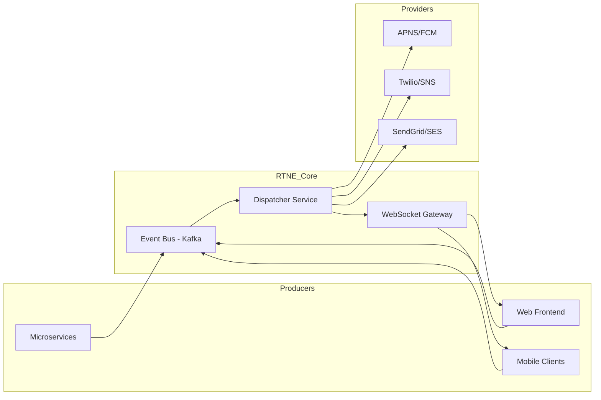
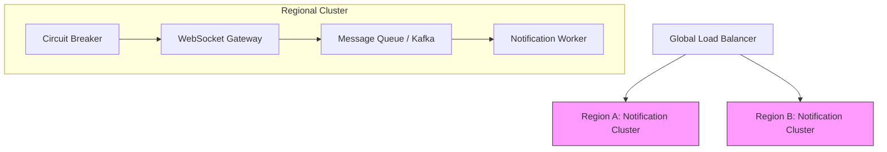
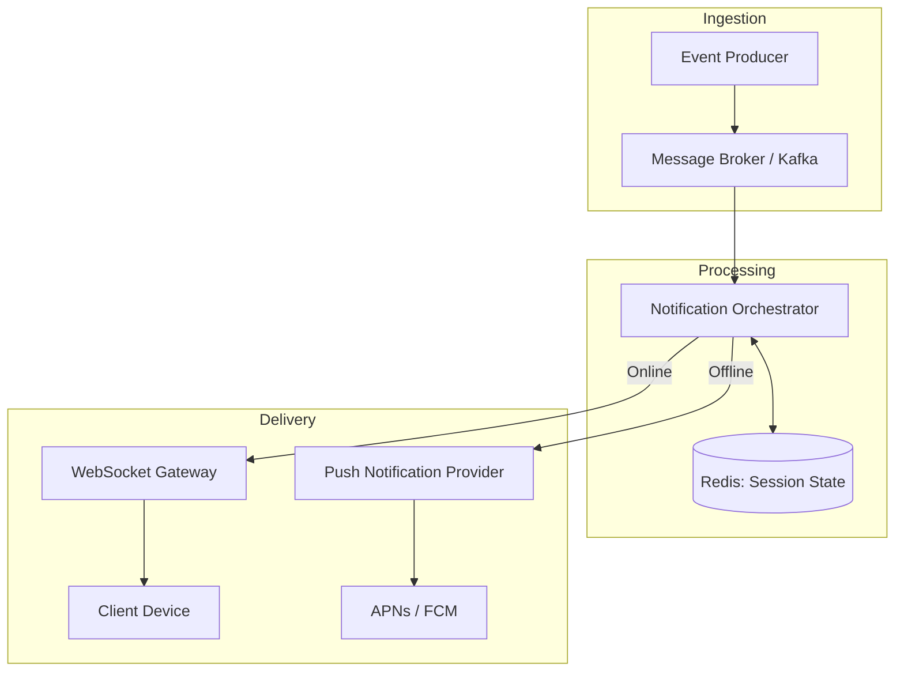
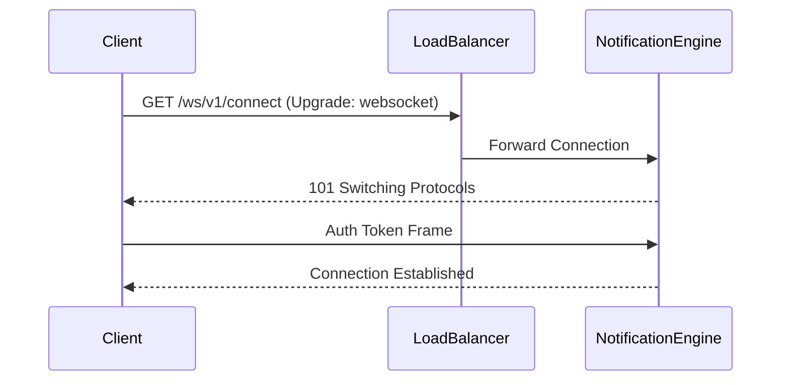
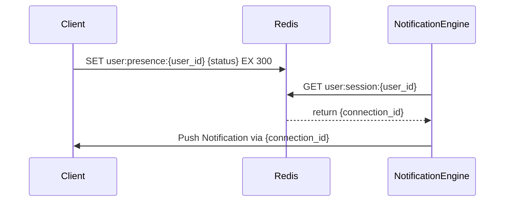
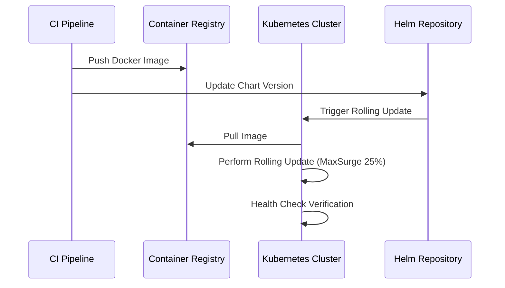

# Real-Time Notification Engine

## 1. System Overview & Context

The Real-Time Notification Engine (RTNE) is a centralized, asynchronous event-driven platform designed to abstract the complexity of cross-channel communication. By decoupling event producers from delivery providers, the system ensures high availability and horizontal scalability across Push, SMS, and Email channels.

### 1.1 Architectural Scope
The RTNE acts as the primary ingress point for all system-generated alerts. It implements a hybrid delivery model:
*   **Active Sessions:** Real-time delivery via persistent WebSocket connections managed by the Gateway Service.
*   **Offline/Asynchronous:** Guaranteed delivery via a distributed message broker (Apache Kafka) for persistent queuing and retry logic.

### 1.2 System Context Diagram



### 1.3 Stakeholder Integration Matrix

| Stakeholder | Interaction Pattern | Primary Protocol |
| :--- | :--- | :--- |
| **Mobile Clients** | Bi-directional | WebSocket (WSS) |
| **Web Frontend** | Bi-directional | WebSocket (WSS) |
| **Internal Microservices** | Producer (Event Emitter) | gRPC / REST |
| **Notification Providers** | Consumer (Delivery) | HTTPS / SMTP |

### 1.4 Non-Functional Requirements (NFRs)

| Metric | Target | Rationale |
| :--- | :--- | :--- |
| **Latency (P99)** | < 200ms | Real-time user experience requirement. |
| **Throughput** | 10k events/sec | Peak load capacity for concurrent microservice bursts. |
| **Durability** | At-least-once | Ensures no notification loss during provider downtime. |
| **Availability** | 99.99% | Critical path for system-to-user communication. |

### 1.5 Event Schema Definition (JSON)
All producers must adhere to the following schema for ingestion into the event bus:

```json
{
  "event_id": "uuid",
  "timestamp": "ISO-8601",
  "channel": "PUSH | SMS | EMAIL",
  "recipient_id": "string",
  "payload": {
    "title": "string",
    "body": "string",
    "metadata": "map<string, string>"
  },
  "priority": "HIGH | NORMAL | LOW"
}
```

## 2. Architectural Goals & Constraints

The Real-Time Notification Engine is designed to operate as a high-throughput, low-latency distributed system. The following architectural constraints and performance benchmarks define the operational boundaries for the service.

### 2.1 Performance and Availability Benchmarks

The system must adhere to the following Non-Functional Requirements (NFRs) to ensure reliability during peak load scenarios:

| Metric | Target | Measurement Point |
| :--- | :--- | :--- |
| **P99 Latency** | < 100ms | WebSocket message dispatch (Egress) |
| **Throughput** | 50,000 msg/sec | Aggregate system capacity |
| **Availability** | 99.99% | Multi-region uptime |
| **Scaling Trigger** | < 60s | Auto-scale response time |

### 2.2 System Resilience Architecture

To maintain 99.99% availability, the architecture utilizes a multi-region active-active deployment model integrated with circuit breaker patterns to prevent cascading failures.



### 2.3 Scaling and Operational Constraints

The system implements horizontal auto-scaling policies governed by the following logic, ensuring resource allocation matches demand fluctuations:

*   **Scaling Policy:** Horizontal Pod Autoscaler (HPA) configured to trigger on `cpu_utilization > 70%` or `queue_depth > 10,000` pending messages.
*   **Data Privacy:** All PII (Personally Identifiable Information) must be encrypted at rest using AES-256. Notification preferences are stored in a partitioned database to ensure regional data residency compliance.
*   **Circuit Breaking:** If the downstream provider latency exceeds 500ms for 5% of requests over a 10-second window, the circuit breaker will transition to an `OPEN` state, routing traffic to a fallback dead-letter queue (DLQ) to prevent resource exhaustion.

### 2.4 Configuration Schema (HPA)

The following YAML snippet defines the scaling threshold for the notification worker deployment:

```yaml
apiVersion: autoscaling/v2
kind: HorizontalPodAutoscaler
metadata:
  name: notification-worker-hpa
spec:
  scaleTargetRef:
    apiVersion: apps/v1
    kind: Deployment
    name: notification-worker
  minReplicas: 10
  maxReplicas: 500
  metrics:
  - type: Resource
    resource:
      name: cpu
      target:
        type: Utilization
        averageUtilization: 70
  - type: External
    external:
      metric:
        name: queue_depth
      target:
        type: AverageValue
        averageValue: 10000
```

## 3. High-Level System Architecture

The Real-Time Notification Engine utilizes an asynchronous, event-driven architecture designed to decouple event ingestion from delivery. The system leverages a distributed message broker to ensure durability and horizontal scalability, while Redis maintains low-latency state management for active WebSocket sessions.

### 3.1 Architectural Flow
The following diagram illustrates the event lifecycle from ingestion to delivery, including the bifurcation between real-time WebSocket dispatch and asynchronous push notification fallback.



### 3.2 Component Responsibilities

| Component | Responsibility |
| :--- | :--- |
| **Event Producer** | Emits standardized notification payloads to the ingress topic. |
| **Message Broker** | Provides backpressure handling and guaranteed at-least-once delivery. |
| **Orchestrator** | Evaluates user presence via Redis; routes events to appropriate delivery channels. |
| **Redis** | Stores ephemeral session metadata (e.g., `user_id:gateway_node_id`) with TTL. |
| **WebSocket Gateway** | Maintains persistent full-duplex connections for real-time delivery. |
| **Push Service** | Handles retry logic and payload transformation for offline delivery. |

### 3.3 Session State Management
The Redis cache is utilized as the primary source of truth for active user sessions. Upon a successful WebSocket handshake, the `WebSocketGateway` registers the connection metadata.

**Redis Schema (Key: `session:user:{user_id}`):**
```json
{
  "user_id": "uuid",
  "gateway_node_id": "ws-node-01",
  "connection_id": "conn-abc-123",
  "last_heartbeat": "2023-10-27T10:00:00Z",
  "status": "online"
}
```

### 3.4 Fallback Mechanism
If the `Orchestrator` fails to locate an active session in Redis, or if the `WebSocketGateway` returns a delivery timeout, the system triggers the fallback workflow:

1. **Persistence:** The event is written to the `notification_history` table in the primary RDBMS for auditability.
2. **Queueing:** The event is pushed to a secondary "Offline-Delivery" queue.
3. **Push Dispatch:** The `PushService` consumes the queue, retrieves the user's device token from the `user_devices` table, and dispatches the payload to the platform-specific provider (APNs for iOS, FCM for Android).

## 4. API & Interface Design

The Notification Engine exposes a dual-interface architecture: a RESTful API for administrative lifecycle management and a WebSocket interface for low-latency, bi-directional event streaming.

### 4.1 RESTful API Specification
The following endpoints facilitate notification lifecycle management and user preference configuration. All requests must be authenticated via JWT and return standard HTTP status codes.

| Method | Endpoint | Description |
| :--- | :--- | :--- |
| `POST` | `/v1/notifications` | Dispatches a new notification to the queue. |
| `GET` | `/v1/notifications/{id}` | Retrieves status of a specific notification. |
| `PUT` | `/v1/users/{user_id}/preferences` | Updates delivery channel configuration. |
| `DELETE` | `/v1/notifications/{id}` | Revokes or cancels a pending notification. |

### 4.2 WebSocket Protocol & Frame Structure
Real-time delivery is managed via a persistent WebSocket connection. Clients must perform a handshake against the `/ws/v1/connect` endpoint.



#### Message Schema
All outbound messages follow a strict JSON schema to ensure type safety across heterogeneous client environments.

```json
{
  "type": "object",
  "properties": {
    "user_id": { "type": "string", "format": "uuid" },
    "payload": { 
      "type": "object",
      "properties": {
        "event_id": { "type": "string" },
        "timestamp": { "type": "string", "format": "date-time" },
        "content": { "type": "object" }
      },
      "required": ["event_id", "content"]
    }
  },
  "required": ["user_id", "payload"]
}
```

### 4.3 OpenAPI 3.0 Dispatch Contract
The dispatching service utilizes the following schema for internal service-to-service communication, ensuring strict payload validation before ingestion into the message broker.

```yaml
openapi: 3.0.0
info:
  title: Notification Dispatching Service
  version: 1.0.0
paths:
  /v1/notifications:
    post:
      summary: Dispatch notification
      requestBody:
        required: true
        content:
          application/json:
            schema:
              $ref: '#/components/schemas/NotificationRequest'
components:
  schemas:
    NotificationRequest:
      type: object
      properties:
        user_id:
          type: string
        payload:
          type: object
      required:
        - user_id
        - payload
```

## 5. Data Storage & Schema Design

The persistence layer is architected to decouple high-velocity write operations from low-latency read requirements. We utilize a polyglot persistence strategy: Amazon DynamoDB for durable, high-throughput notification event logging, and Redis for ephemeral state management and real-time presence tracking.

### 5.1 Notification Log Schema (DynamoDB)
To ensure horizontal scalability and consistent performance under heavy write loads, the `notifications` table utilizes a partition key based on `user_id` to ensure data locality, with `notification_id` as the sort key for efficient range queries.

| Attribute | Type | Description |
| :--- | :--- | :--- |
| `user_id` | UUID | Partition Key; identifies the notification recipient. |
| `notification_id` | UUID | Sort Key; unique identifier for the event. |
| `idempotency_key` | String | Indexed attribute to prevent duplicate processing. |
| `payload` | Map | JSON blob containing notification content. |
| `status` | String | Delivery state (PENDING, DELIVERED, FAILED). |
| `created_at` | Timestamp | ISO-8601 epoch time for TTL and sorting. |

```sql
-- Schema definition for the primary notification log
CREATE TABLE notifications (
    user_id UUID,
    notification_id UUID,
    idempotency_key UUID UNIQUE,
    status TEXT,
    payload JSONB,
    created_at TIMESTAMP DEFAULT CURRENT_TIMESTAMP,
    PRIMARY KEY (user_id, notification_id)
);
```

### 5.2 Transient State & Presence (Redis)
Redis is employed to maintain real-time session mapping and user presence. This minimizes latency for the notification routing engine by avoiding expensive lookups in the primary database.



### 5.3 Idempotency Strategy
To guarantee exactly-once delivery semantics, the system enforces idempotency at the storage layer. Before persisting a new notification, the engine performs a conditional write operation based on the `idempotency_key`.

```json
{
  "ConditionExpression": "attribute_not_exists(idempotency_key)",
  "Item": {
    "user_id": "550e8400-e29b-41d4-a716-446655440000",
    "notification_id": "a1b2c3d4-e5f6-7890-abcd-1234567890ab",
    "idempotency_key": "req-uuid-998877",
    "status": "PENDING",
    "created_at": 1715856000
  }
}
```

### 5.4 Non-Functional Requirements (NFRs)
| Metric | Target | Rationale |
| :--- | :--- | :--- |
| Write Latency | < 10ms (p99) | Ensure non-blocking ingestion of events. |
| Availability | 99.99% | Multi-AZ deployment for persistence layer. |
| Data Retention | 30 Days | Compliance and audit requirements for logs. |

## 6. Deployment & Infrastructure

The Real-Time Notification Engine utilizes a containerized architecture orchestrated via Kubernetes to ensure high availability, horizontal scalability, and environment parity.

### 6.1 Orchestration Strategy
The service is deployed as a stateless workload within a Kubernetes cluster. We utilize Helm for templating and lifecycle management, allowing for environment-specific configuration injection via `values.yaml` files. Service discovery is managed natively through Kubernetes Services, providing stable internal endpoints for inter-service communication.

### 6.2 Deployment Configuration
The following manifest defines the base deployment strategy for the notification service, ensuring a minimum of three replicas to maintain availability during rolling updates.

```yaml
apiVersion: apps/v1
kind: Deployment
metadata:
  name: notification-service
  labels:
    app: notification-engine
spec:
  replicas: 3
  selector:
    matchLabels:
      app: notification-service
  template:
    metadata:
      labels:
        app: notification-service
    spec:
      containers:
      - name: notification-api
        image: registry.internal/notification-service:latest
        ports:
        - containerPort: 8080
        resources:
          requests:
            cpu: "250m"
            memory: "512Mi"
          limits:
            cpu: "500m"
            memory: "1Gi"
```

### 6.3 Infrastructure Requirements
The deployment relies on the following infrastructure components to maintain operational integrity:

| Component | Purpose | Requirement |
| :--- | :--- | :--- |
| **Ingress Controller** | L7 Load Balancing | NGINX or Istio Ingress Gateway |
| **ConfigMaps** | Environment Variables | Decouple config from container image |
| **Horizontal Pod Autoscaler** | Scaling Policy | CPU threshold > 70% |
| **Liveness/Readiness Probes** | Health Monitoring | `/healthz` and `/ready` endpoints |

### 6.4 Deployment Workflow
The deployment process follows a declarative GitOps pattern, ensuring that the cluster state matches the version-controlled Helm charts.



### 6.5 Environment Parity
To ensure consistency across environments, we enforce the following constraints:
1. **Immutable Images:** Images are tagged with the Git SHA; no `latest` tags are permitted in production.
2. **Secret Management:** Sensitive credentials (e.g., SMTP, Push Provider API keys) are injected via Kubernetes Secrets, sourced from a secure vault provider.
3. **Resource Quotas:** Namespaces are strictly limited by resource quotas to prevent noisy-neighbor scenarios within the cluster.
