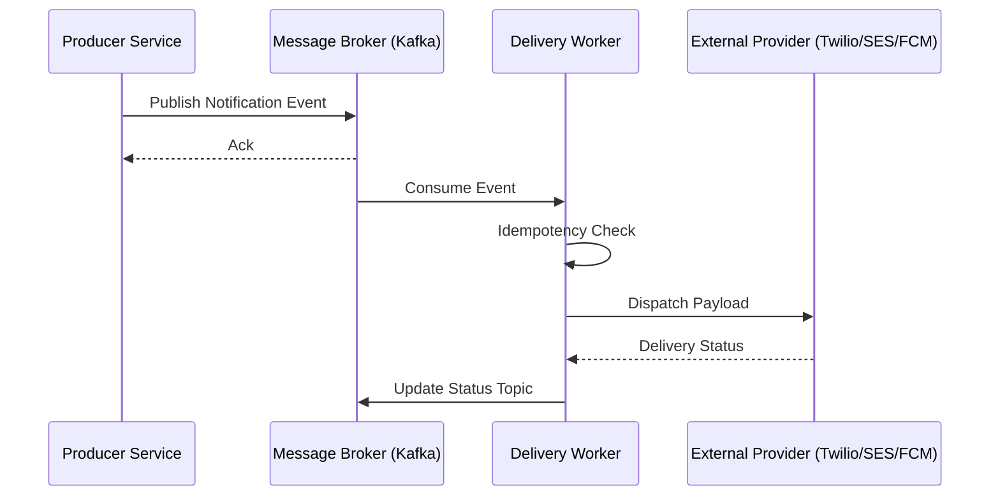
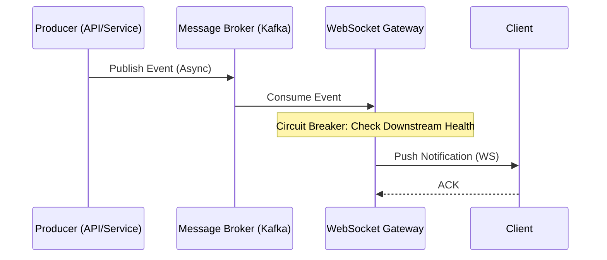
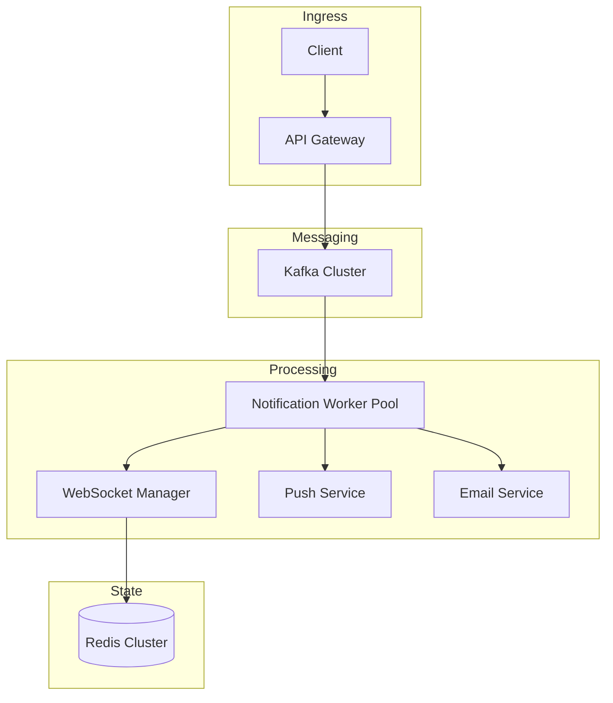
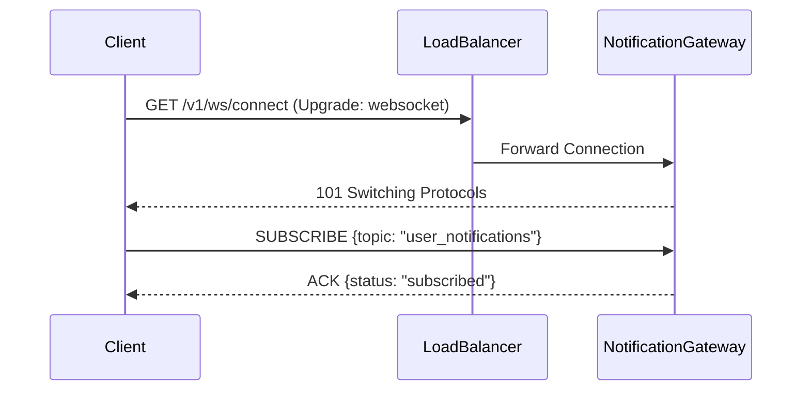
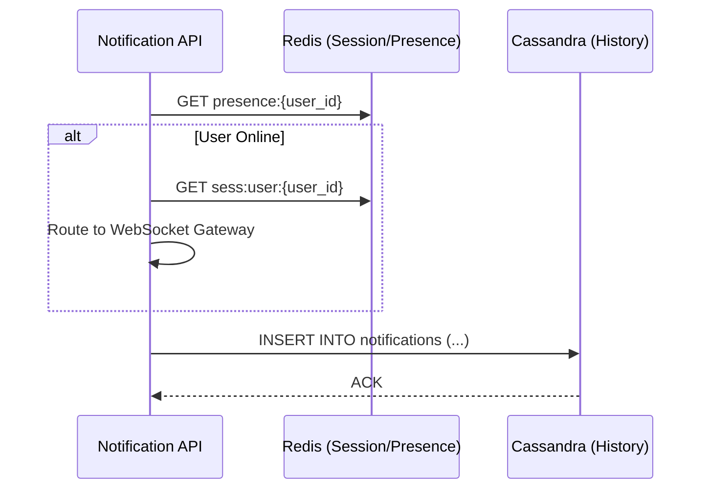

# Real-Time Notification System Architecture

## 1. System Overview & Context

The Real-Time Notification System (RTNS) is designed as a high-throughput, asynchronous delivery engine responsible for orchestrating multi-channel communications (Push, Email, SMS). The architecture prioritizes decoupling, fault tolerance, and horizontal scalability by leveraging an event-driven paradigm.

### 1.1 Architectural Scope
The RTNS acts as a middleware layer between internal microservices (Producers) and external Communication Service Providers (CSPs). The system scope is strictly limited to message ingestion, template resolution, routing, and delivery status tracking. It explicitly excludes user preference management and notification content generation, which are handled by upstream domain services.

### 1.2 High-Level Data Flow
The following sequence illustrates the decoupled interaction between the event producers, the message broker, and the delivery workers.



### 1.3 Non-Functional Requirements (NFRs)

| Metric | Target | Rationale |
| :--- | :--- | :--- |
| **Latency** | < 500ms (p99) | Real-time delivery for active user sessions. |
| **Availability** | 99.99% | Critical path for user engagement and security alerts. |
| **Consistency** | Eventual | Decoupled architecture favors availability over strong consistency. |
| **Durability** | Zero Data Loss | Persistent message queuing with multi-AZ replication. |

### 1.4 System Boundaries
The system is defined by the following functional boundaries:

*   **Ingestion API:** RESTful interface for synchronous event submission.
*   **Message Broker:** Distributed log (Apache Kafka) providing backpressure management and message persistence.
*   **Delivery Workers:** Stateless consumers responsible for template hydration and provider-specific protocol translation.
*   **Idempotency Layer:** Redis-backed state store to ensure exactly-once processing semantics for downstream providers.

### 1.5 Configuration Schema (Event Payload)
All incoming events must conform to the following JSON schema to ensure compatibility across the delivery pipeline:

```json
{
  "event_id": "uuid-v4",
  "user_id": "string",
  "channel": "PUSH | EMAIL | SMS",
  "template_id": "string",
  "payload": {
    "key": "value"
  },
  "metadata": {
    "priority": "HIGH | LOW",
    "ttl_seconds": 3600
  }
}
```

## 2. Architectural Goals & Constraints

The Real-Time Notification System is engineered to operate as a high-concurrency, distributed event-processing pipeline. The architecture prioritizes low-latency delivery and horizontal scalability to accommodate bursty traffic patterns while maintaining strict adherence to availability and compliance standards.

### 2.1 Non-Functional Requirements (NFRs)

The following table defines the critical performance and operational constraints governing the system design:

| Metric | Target | Rationale |
| :--- | :--- | :--- |
| **P99 Latency** | < 200ms | Ensures real-time user experience for WebSocket-based push events. |
| **Throughput** | 50,000 events/sec | Supports peak load requirements for global user base. |
| **Availability** | 99.99% | Requires multi-region active-active deployment and fault isolation. |
| **Data Privacy** | GDPR/CCPA Compliant | Mandatory encryption at rest/transit and PII masking in logs. |
| **Resource Efficiency** | Auto-scaling | Minimize idle compute costs via K8s HPA and event-driven scaling. |

### 2.2 Architectural Strategy

To meet the defined NFRs, the system employs a decoupled, asynchronous architecture. The following sequence diagram illustrates the high-level flow from event ingestion to client delivery, highlighting the integration of circuit breakers and regional load balancing.



### 2.3 Constraint Implementation

*   **Fault Tolerance:** The system utilizes the Circuit Breaker pattern (via Resilience4j or Istio) to prevent cascading failures when downstream notification providers (e.g., FCM, APNs) experience latency spikes.
*   **Scalability:** The WebSocket Gateway layer is stateless, allowing for horizontal scaling across Kubernetes clusters. Session state is offloaded to a distributed Redis cluster to ensure seamless reconnection during pod churn.
*   **Data Privacy:** All notification payloads containing PII must be encrypted using AES-256 at the application layer before persistence in the event store. Database schemas must enforce strict separation between metadata and user-identifiable contact information.

### 2.4 Resource Optimization Configuration

To minimize operational costs during idle periods, the system utilizes Kubernetes Horizontal Pod Autoscaler (HPA) based on custom metrics (e.g., Kafka consumer lag) rather than CPU/Memory utilization alone.

```yaml
# Example HPA configuration for Notification Workers
apiVersion: autoscaling/v2
kind: HorizontalPodAutoscaler
metadata:
  name: notification-worker-hpa
spec:
  scaleTargetRef:
    apiVersion: apps/v1
    kind: Deployment
    name: notification-worker
  minReplicas: 2
  maxReplicas: 100
  metrics:
  - type: External
    external:
      metric:
        name: kafka_consumer_lag
      target:
        type: AverageValue
        averageValue: 500
```

## 3. High-Level System Architecture

The notification system utilizes an asynchronous, event-driven architecture designed to decouple ingestion from delivery. The API Gateway acts as the ingress point, validating requests and producing events to Apache Kafka. The Notification Workers consume these events, orchestrating delivery across multiple channels (Push, Email, SMS). Real-time state management is handled by a dedicated WebSocket Connection Manager, which maintains persistent client sessions and facilitates low-latency message dispatch.

### 3.1 Architectural Topology



### 3.2 Component Responsibilities

| Component | Responsibility |
| :--- | :--- |
| **API Gateway** | Request validation, authentication, and event ingestion into Kafka topics. |
| **Kafka Cluster** | Durable message queuing and decoupling of producers from consumers. |
| **Notification Worker** | Business logic execution, template rendering, and routing to downstream providers. |
| **WebSocket Manager** | Maintains persistent TCP/TLS connections; tracks client presence and session state. |
| **Redis Cluster** | Stores ephemeral session metadata and mapping of `user_id` to `connection_id`. |

### 3.3 Horizontal Scaling Strategy

The worker pool scales dynamically based on consumer lag metrics to ensure delivery latency remains within defined SLAs. The scaling logic is governed by the following parameters:

*   **Metric Source:** Kafka `records-lag-max` per consumer group.
*   **Scaling Trigger:** If `avg(consumer_lag) > 5000` for a duration of 60 seconds, trigger a horizontal pod autoscaler (HPA) event.
*   **Cooldown Period:** 300 seconds to prevent thrashing during transient traffic spikes.

**Kubernetes HPA Configuration (YAML):**

```yaml
apiVersion: autoscaling/v2
kind: HorizontalPodAutoscaler
metadata:
  name: notification-worker-hpa
spec:
  scaleTargetRef:
    apiVersion: apps/v1
    kind: Deployment
    name: notification-worker
  minReplicas: 3
  maxReplicas: 50
  metrics:
  - type: External
    external:
      metric:
        name: kafka_consumer_lag
      target:
        type: AverageValue
        averageValue: 5000
```

This strategy ensures that the system maintains throughput parity with incoming event volume, preventing backpressure from impacting the API Gateway's ingestion capabilities.

## 4. API & Interface Design

The notification system utilizes a hybrid communication model: RESTful APIs for administrative scheduling and state management, and WebSockets for low-latency, bi-directional event delivery. All interfaces are versioned via URI prefixing (e.g., `/v1/`) to ensure backward compatibility for mobile client integrations.

### 4.1 RESTful API Specification

The following endpoints facilitate the lifecycle management of notification tasks.

| Method | Endpoint | Description | Auth |
| :--- | :--- | :--- | :--- |
| POST | `/v1/notifications` | Schedule a new notification task | JWT |
| GET | `/v1/notifications/{id}` | Retrieve status/metadata of a notification | JWT |
| PATCH | `/v1/notifications/{id}/cancel` | Revoke a pending notification | JWT |

### 4.2 WebSocket Protocol & Event Subscription

Real-time updates are delivered via a persistent WebSocket connection. Clients must perform a handshake against the `/v1/ws/connect` endpoint.



### 4.3 Notification Payload Schema

All notification payloads must conform to the following JSON schema to ensure strict type safety across the message bus and delivery workers.

```json
{
  "type": "object",
  "required": ["user_id", "channel", "payload"],
  "properties": {
    "user_id": { "type": "string", "format": "uuid" },
    "channel": { "type": "string", "enum": ["push", "email", "sms", "in-app"] },
    "payload": {
      "type": "object",
      "properties": {
        "title": { "type": "string" },
        "body": { "type": "string" },
        "metadata": { "type": "object" }
      }
    }
  }
}
```

### 4.4 Versioning Strategy

To maintain stability for mobile clients, the system adheres to the following versioning constraints:
1. **URI Versioning:** Major versions are incremented in the URI (`/v1/`, `/v2/`).
2. **Deprecation Policy:** Deprecated endpoints return a `Warning` header for 90 days prior to decommissioning.
3. **Schema Evolution:** Additive changes to the `payload` object are permitted; however, removing fields or changing data types requires a major version increment to prevent breaking changes in client-side deserialization logic.

## 5. Data Storage & Schema Design

The persistence layer is architected to decouple high-velocity write operations from low-latency read requirements. We utilize a polyglot persistence strategy, leveraging Apache Cassandra for immutable notification logs and Redis for ephemeral state management.

### 5.1 Notification History (Cassandra)
To accommodate high-write throughput and horizontal scalability, notification logs are stored in Cassandra. The schema is optimized for partition-key-based lookups by `user_id` to ensure efficient retrieval of user-specific notification feeds.

```sql
CREATE TABLE notification_service.notifications (
    user_id UUID,
    created_at TIMESTAMP,
    id UUID,
    payload TEXT,
    status TEXT,
    metadata MAP<TEXT, TEXT>,
    PRIMARY KEY (user_id, created_at, id)
) WITH CLUSTERING ORDER BY (created_at DESC)
  AND default_time_to_live = 7776000; -- 90-day TTL policy
```

### 5.2 Ephemeral State & Session Management (Redis)
Redis serves as the primary store for active WebSocket session mappings and user presence. This ensures sub-millisecond lookup times for routing outbound events.

| Key Pattern | Data Type | Purpose | TTL |
| :--- | :--- | :--- | :--- |
| `sess:user:{user_id}` | Hash | Maps `user_id` to `node_id` and `socket_id` | 30m (Sliding) |
| `presence:{user_id}` | String | Tracks online/offline status | 5m |
| `rate_limit:{user_id}` | Counter | Prevents notification flooding | 60s |

### 5.3 Data Flow Architecture
The following sequence illustrates the interaction between the ingestion service, the primary storage, and the caching layer during a notification event.



### 5.4 Non-Functional Requirements (NFRs)
*   **Write Throughput:** The system must support a sustained write load of 50k events/second.
*   **Data Retention:** Records older than 90 days are automatically purged via Cassandra's native TTL mechanism to maintain cluster performance.
*   **Consistency:** Eventual consistency is acceptable for notification history; strong consistency is required for session mapping within the Redis cluster.

## 6. Deployment & Infrastructure

The notification system is deployed as a containerized microservices architecture orchestrated via Kubernetes (K8s). Infrastructure is managed through declarative manifests to ensure environment parity and idempotency.

### 6.1 Containerization Strategy
All services utilize multi-stage Docker builds to minimize the attack surface and reduce image footprint. The build process separates the compilation environment (e.g., Go/Node.js SDKs) from the runtime environment, ensuring only the binary and essential runtime dependencies are included in the final production image.

### 6.2 Kubernetes Orchestration
The system utilizes Horizontal Pod Autoscalers (HPA) to maintain service availability during traffic spikes. Scaling policies are triggered by CPU utilization (target: 70%) and memory pressure.

#### Deployment Manifest (Sample)
```yaml
apiVersion: apps/v1
kind: Deployment
metadata:
  name: notification-worker
  labels:
    app: notification-system
    tier: worker
spec:
  replicas: 3
  selector:
    matchLabels:
      app: notification-worker
  template:
    metadata:
      labels:
        app: notification-worker
    spec:
      containers:
      - name: worker
        image: registry.internal/notification-worker:v1.2.4
        resources:
          requests:
            cpu: "250m"
            memory: "512Mi"
          limits:
            cpu: "500m"
            memory: "1Gi"
        ports:
        - containerPort: 8080
```

### 6.3 Observability and Alerting
The infrastructure integrates Prometheus for time-series metric collection and Grafana for visualization. Alerting rules are configured to trigger on delivery failure thresholds and latency degradation.

| Component | Function | Metric Source |
| :--- | :--- | :--- |
| **Prometheus** | Metrics Aggregation | `/metrics` endpoint (OpenMetrics) |
| **Grafana** | Dashboarding | Prometheus Data Source |
| **Alertmanager** | Incident Routing | PagerDuty / Slack Webhooks |
| **Node Exporter** | Infrastructure Health | K8s Node CPU/RAM/Disk |

### 6.4 Infrastructure Requirements
*   **Container Registry:** Private OCI-compliant registry with vulnerability scanning enabled (e.g., Harbor or AWS ECR).
*   **Network Policy:** Default-deny ingress/egress policy; traffic is restricted to internal service-to-service communication via mTLS.
*   **Resource Quotas:** Namespace-level resource limits to prevent noisy-neighbor scenarios within the cluster.
